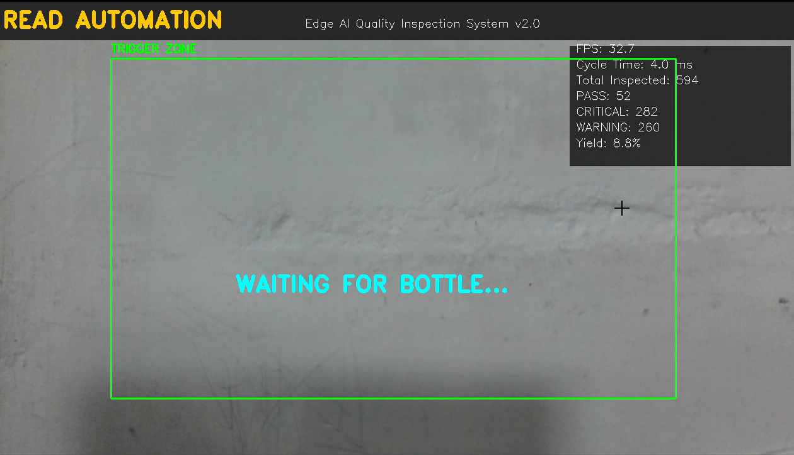
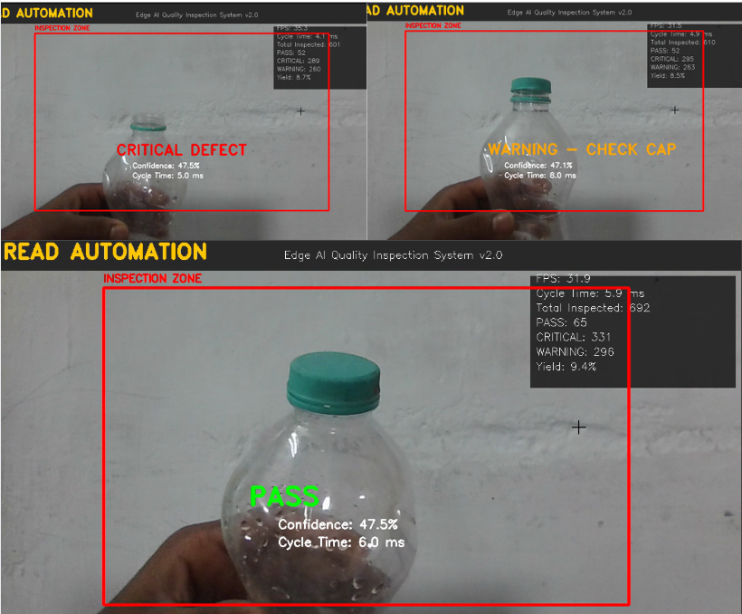

# 🏭 Edge AI Quality Inspection System

Advanced Edge-Based Automated Optical Inspection System for Bottle Manufacturing using an optimized **MobileNetV2** deep learning model.


## 🚀 Features

* 🤖 **Edge AI Processing** — Runs entirely on standard CPU hardware without requiring an expensive GPU.
* ⚡ **Ultra-Fast Inference** — Achieves **447 FPS** with just **2.23 ms latency** using Intel OpenVINO optimization.
* 🎯 **High Accuracy** — Achieves **95% overall classification accuracy** with **100% recall on critical defects (Missing Caps)**.
* 🎥 **Smart Motion Trigger** — Uses frame differencing to reduce idle CPU overhead by approximately **60%**.
* 💡 **Adaptive Preprocessing** — Uses **CLAHE** to improve robustness across varying factory lighting conditions from **200–2000 lux**.

## 📸 System States

The inspection pipeline dynamically switches between an idle monitoring state and active classification, detecting three bottle-cap conditions.

| 1. Idle State — Waiting for Bottle | 2. Active Inspection — Classification |
| :------------------------------------: | :--------------------------------------: |
|  |  |

### Inspection Results

* 🟢 **PASS** — Properly sealed cap.
* 🟠 **WARNING** — Loose or crooked cap.
* 🔴 **CRITICAL** — Missing cap.

## 🧠 System Architecture

The system follows an optimized edge-AI inspection pipeline:

```text
Camera
↓
Frame Capture
↓
Motion Detection
↓
Image Preprocessing
↓
CLAHE Enhancement
↓
MobileNetV2 Classification
↓
OpenVINO Optimized Inference
↓
Defect Classification
↓
PASS / WARNING / CRITICAL
```

## 🛠️ Hardware Requirements

* **Processor:** Standard Laptop CPU
* **Benchmark CPU:** Intel Core i5-12500HX
* **Camera:** Integrated 720p HD Webcam
* **RAM:** 16 GB DDR4
* **Minimum RAM:** 8 GB

## 💻 Installation & Usage

### 1. Clone the Repository

```bash
git clone https://github.com/Bhogeswarareddy/edge-ai-quality-inspection.git
cd edge-ai-quality-inspection
```

### 2. Install Dependencies

```bash
pip install -r requirements.txt
```

### 3. Run the Inspection System

```bash
python main.py
```

## 📊 Performance Benchmark

The system demonstrates a **23.8% performance improvement** when migrating from standard **TensorFlow Lite (FP32)** to **Intel OpenVINO (FP16)**.

| Metric | Result |
| ----------------------- | ----------: |
| Inference Speed | **447 FPS** |
| Inference Latency | **2.23 ms** |
| Overall Accuracy | **95%** |
| Critical Defect Recall | **100%** |
| CPU Overhead Reduction | **~60%** |
| Model Size Reduction | **48.3%** |
| Original Model Size | **8.9 MB** |
| Optimized Model Size | **4.6 MB** |
| Performance Improvement | **23.8%** |

The model size was compressed from **8.9 MB to 4.6 MB**, while maintaining critical defect detection performance.

## 🔧 Technologies Used

* **Python**
* **TensorFlow / TensorFlow Lite**
* **MobileNetV2**
* **OpenCV**
* **Intel OpenVINO**
* **Computer Vision**
* **Deep Learning**
* **Edge AI**
* **CLAHE**
* **Frame Differencing**

## 🎯 Defect Detection

The system classifies bottle caps into three categories:

```text
Bottle
│
▼
Motion Detected?
/ \
No Yes
│ │
Idle State Preprocessing
│
▼
MobileNetV2
│
┌───────────┼───────────┐
▼ ▼ ▼
PASS WARNING CRITICAL
Proper Cap Loose Cap Missing Cap
```

## 🌍 Real-World Application

This system is designed for automated quality inspection in bottle manufacturing environments.

Instead of relying on manual inspection, a camera continuously monitors bottles moving through the production line. When a bottle enters the inspection area, the motion-triggered pipeline activates the AI classifier and determines whether the bottle cap is:
* Properly sealed
* Loose or misaligned
* Completely missing

Because inference runs efficiently on standard CPU hardware, the system can be deployed at the **edge**, reducing the need for expensive GPU infrastructure and minimizing response latency.

## 📈 Key Advantages

* ✅ Real-time bottle inspection
* ✅ CPU-based edge deployment
* ✅ Low inference latency
* ✅ High critical-defect recall
* ✅ Reduced idle CPU utilization
* ✅ Robustness to lighting variations
* ✅ Lightweight optimized model
* ✅ Suitable for industrial automation

## 📄 License

This project is licensed under the **MIT License**.

## 🙏 Acknowledgments

* Neural Network Architecture based on **MobileNetV2**
* Accelerated inference powered by **Intel OpenVINO Toolkit**
* Computer Vision pipeline built with **OpenCV**
* TensorFlow Lite used for lightweight model deployment

## ⭐ Support

If you find this project useful, consider giving the repository a ⭐ **Star**.

## 👨‍💻 Author

**Bhogeswar Reddy Katakam**  
🎓 B.Tech CSE — Artificial Intelligence & Machine Learning  
🔗 **GitHub:** https://github.com/Bhogeswarareddy  
🔗 **LinkedIn:** https://www.linkedin.com/in/bhogeswarareddy-katakam/

---

Made with ❤️ and 🤖 by **Bhogeswar Reddy Katakam**